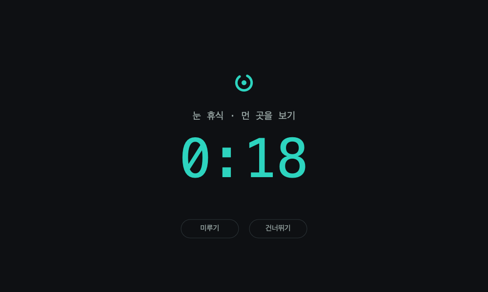
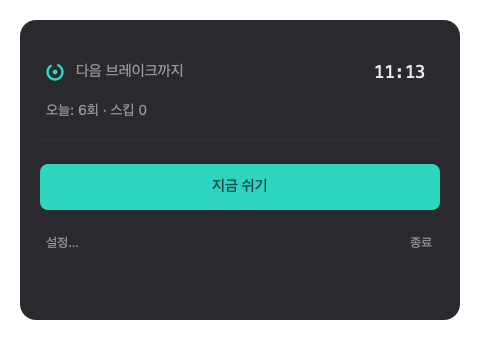
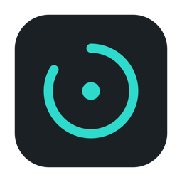

# Blink

A macOS menu-bar eye-break reminder based on the 20-20-20 rule. Fully local — no account, no cloud, no data leaves your Mac.

## Preview

> Design mockups, rendered from the app's actual palette, typography, and layout — not live screenshots.

   
  <em>Break overlay — look away for a moment, with skip and postpone.</em>

  
  &nbsp;&nbsp;&nbsp;
  

## Features

- **Two-tier breaks** — a short eye break every 20 minutes and a longer break every 60 minutes (configurable).
- **Overlay or notification** — each break kind shows a full-screen overlay or a notification banner, your choice. Every break can be skipped or postponed.
- **Smart pause** — the timer pauses when you step away (idle) and postpones a break while a full-screen app is active.
- **Menu-bar countdown** — the time until your next break is shown right in the menu bar.
- **Today's summary** — breaks taken and skipped, kept in a small local file.
- **Launch at login** — optional, toggled in Settings.

## Develop

- Build: `swift build`
- Test: `swift test`
- Run (dev): `swift run Blink` — for fast iteration use `BLINK_FAST=1 swift run Blink`, which shrinks all intervals to seconds.

## Install (.app)

- Run `./packaging/make-app.sh` to produce `Blink.app`.
- Move it to `/Applications` and launch it. It runs as a menu-bar app (no Dock icon); control it from the ring icon in the menu bar.
- Launch-at-login (Settings toggle) only works from the bundled `.app`, not from `swift run`.

## Architecture

- `BlinkCore` — pure logic (state machine, scheduler, stats, config). No AppKit/SwiftUI, fully covered by `swift test`. Kept UI-free so the design can be reused if a Windows port is ever built.
- `Blink` — the macOS UI layer (MenuBarExtra, NSPanel overlay, notifications, idle/full-screen detection, Settings, launch-at-login).

## Design notes

- Requires macOS 14 (Sonoma) or later. Swift 5.9+, no external dependencies — standard frameworks only.
- The app icon is generated from code (`packaging/make-icon.swift`, CoreGraphics) — no image assets to maintain.
